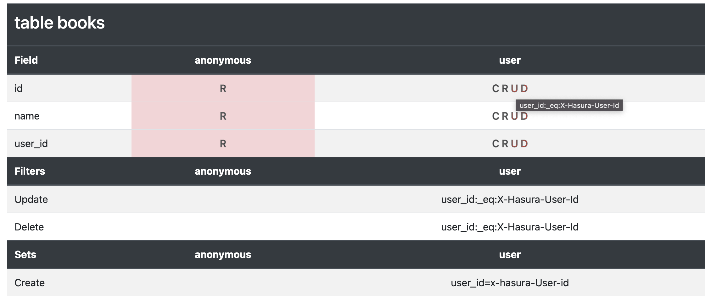

# hasura-permissions-viewer [](https://www.npmjs.com/package/@socialgouv/hasura-permissions-viewer)

Generate an HTML overview of tables permissions from hasura metadata.



## Usage

Drop the result of from Hasura console `Export metadata` into the demo : https://socialgouv.github.io/hasura-permissions-viewer

Or use as npm module :

```js
const toHtml = require("@socialgouv/hasura-permissions-viewer");

const metadata = require("./metadata.json");

// to get the formatted HTML tables
console.log(toHtml(metadata));
```

